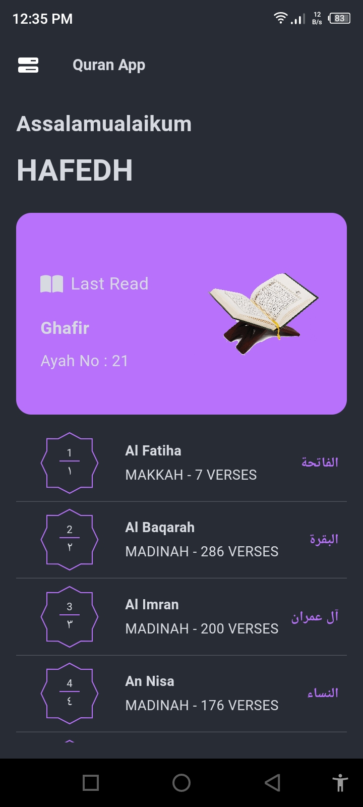

## Quran Companion
The Quran Companion is a user-friendly mobile application designed to provide an enriched and seamless experience for reading, studying, and exploring the Holy Quran. With a simple and intuitive interface, this app aims to facilitate access to the sacred text, fostering a deeper connection with the teachings and wisdom of the Quran.

## Key Features
Versatile Reading Modes: Engage with the Quran in multiple languages, translations, and recitations, providing a comprehensive experience for users of diverse backgrounds.
Bookmarking and Notes: Personalize your Quranic journey by bookmarking favorite verses and adding personal notes to reflect on their meanings or interpretations.
Search and Discover: Effortlessly search for specific verses, chapters, or keywords, enhancing exploration and comprehension of the Quran's profound teachings.
Customizable Experience: Adapt the app's appearance with various themes, fonts, and text sizes for a personalized reading experience.
Audio Recitations: Listen to recitations by renowned scholars and Qaris, allowing users to experience the Quran's beautiful oral tradition.
Accessibility: A user-friendly interface and inclusive design ensure easy navigation and usage for users of all ages and abilities.
Whether you're a scholar, a student, or someone seeking spiritual guidance, the Quran Companion app is your trusted companion for a profound and meaningful Quranic experience.

## Installation
The Quran Companion app is available for <a>iOS</a> and <a>Android</a>, providing a seamless Quranic experience on your mobile device. Simply download from the respective app stores and embark on a transformative journey with the Quran.

  

